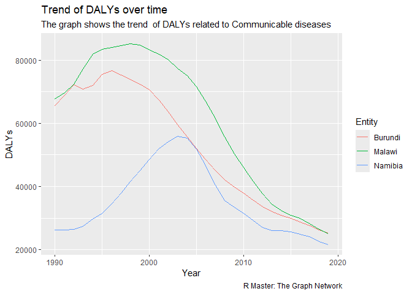

Global Disease Burden Analysis
================
Ester Nepolo

# Introduction

This document compares the Disability-Adjusted Life Year (DALY) diseases
burden for three countries: Namibia , Burundi , and Malawi. We compare
the burden due to communicable, maternal, neonatal, and nutritional
diseases (CMNN), non-communicable diseases (NCDs), and overall disease
burden for these countries.

The source data is from the Institute for Health Metrics and Evaluation
(IHME) Global Burden of Disease (GBD) study.

# Communicable, Maternal, Neonatal, and Nutritional Disease Burden (CMNN)

## Table of Estimates for CMNN Burden Over Time

## Plot Showing Trends in CMNN Burden Over Time

<!-- -->

## Summary of CMNN Burden Findings

The findings shows a notable difference in the trends DALY related to
Communicable Diseases between the Burundi, Malawi and Namibia. All three
countries experienced a high burden of communicable diseases between the
year 1990 and 2005. Notably, whilst Burundi and Malawi’s burden started
to decline around 1995, Namibia’s burden was on the steady rise and only
reached a peak around the year 2004. This could be attributed to delayed
health response and interventions for HIV/AIDS and TB that was prevalent
in the country during that time.

<!-- ```{r child='ncd_burden.Rmd'} -->
<!-- ``` -->
<!-- ```{r child='overall_burden.Rmd'} -->
<!-- ``` -->
